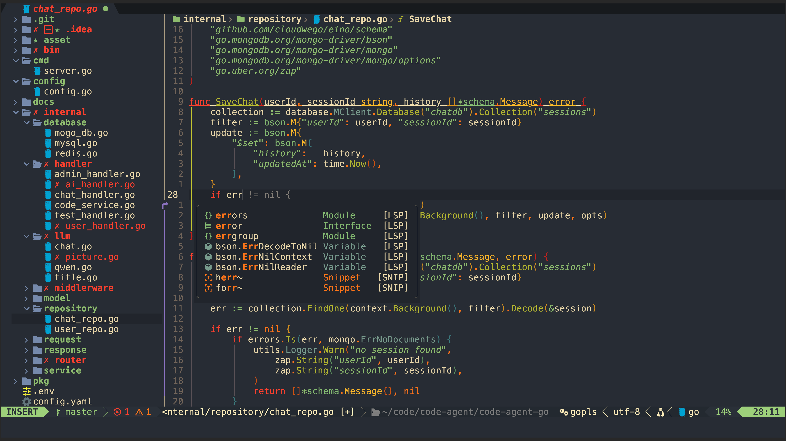

# tsumugi.nvim

> A beautiful color scheme for Neovim.

`tsumugi.nvim` is a carefully crafted color scheme for Neovim, designed to provide a comfortable and pleasant coding experience.

## Preview

 

## Requirements

Neovim 0.10 or Neovim nightly

## Installation

### [lazy.nvim](https://github.com/folke/lazy.nvim)

```lua
return {
  'NexusXian/tsumugi.nvim',
  name = 'tsumugi',
  lazy = false, -- make sure we load this during startup if it is your main colorscheme
  priority = 1000, -- make sure to load this before all the other start plugins
  config = function()
    vim.cmd('colorscheme tsumugi')
  end,
}
```

## Configuration

Make sure to enable true color in your Neovim configuration:

```lua
vim.opt.termguicolors = true
```

## License

GPL

This project is based on [vim-deus](https://github.com/ajmwagar/vim-deus) and follows the GPL license.

## Contributing

Contributions are welcome! Feel free to open issues or submit pull requests.
